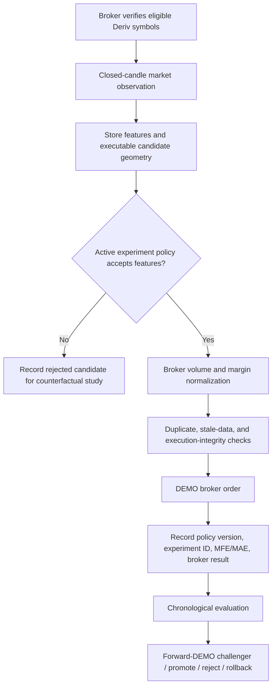

# Deriv Autonomous DEMO Research Architecture

## Purpose

This system is a **broker-connected DEMO research and execution engine** for Deriv Synthetic Indices and Gold (`XAUUSD` and `XAUUSDmicro`). It does not claim consciousness, guaranteed profitability, or unsupported web intelligence. Its learning is a measurable process: it records broker-realized outcomes, tests explicit policy hypotheses, rejects weak candidates, and only then permits a policy to advance through a versioned DEMO lifecycle.

> **Trading policy is experimental. Software integrity is mandatory.**
>
> The engine may test entry logic, risk, reward-to-risk, stops, targets, layers, frequency, and management. It must always retain broker-symbol validation, closed-candle data discipline, duplicate prevention, order synchronization, volume normalization, API-failure handling, crash recovery, and emergency stop behavior.

| Boundary | What the system does | What it does not do |
|---|---|---|
| Market scope | Uses broker-verified Deriv Synthetic Indices and Gold only. | It does not execute unsupported forex, crypto, or external instruments. |
| Data | Uses broker-provided closed candles and broker-realized trade outcomes. | It does not fill gaps with synthetic candles or treat unverified data as evidence. |
| Learning | Evaluates documented hypotheses and policy versions. | It does not call itself self-aware or infer performance from unmeasured claims. |
| Mode control | Runs research promotion only in DEMO. | It never activates or changes LIVE automatically. |

## Experimental Policy Object

Every candidate and every executed bot-managed trade is linked to a policy payload, a policy fingerprint, a model version, and—where relevant—a forward-DEMO experiment ID. The `ExperimentalPolicy` object in `analysis/policies.py` is the source of truth.

| Policy family | Examples currently represented |
|---|---|
| Entry model | Aggressive, confirmation, retracement, breakout, reversal, continuation, liquidity sweep, order block, fair value gap, supply/demand, hybrid. |
| Feature hypotheses | HTF context, liquidity, sweep, displacement, BOS/CHOCH, retracement, confirmation, order-block/FVG/supply-demand zone source. |
| Risk and sizing | Risk percentage or fixed-volume sizing, always normalized to broker volume steps and available margin. |
| Stop and target | Structural, zone, or ATR stop; liquidity/structure/dynamic or fixed-RR target. |
| Management | No management, breakeven, structural trailing, profit lock, partial exit, target extension, and opposing-structure exit behavior. |
| Exposure and frequency | Layer count/style/allocation, concurrent positions, trade frequency, cooldown, daily target, and daily drawdown response. |

A missing policy limit is intentionally treated as **no limit of that type**, not as an implicit conventional restriction. The system still rejects malformed trade geometry, unavailable broker symbols, duplicate submissions, and broker-invalid orders.

## Evidence Lifecycle

The lifecycle in `analysis/optimizer.py` is chronological and auditable.

| Stage | Required evidence | Result |
|---|---|---|
| Hypothesis generation | Completed DEMO trades with stored `pnl_r` and setup features. | Persisted falsifiable hypothesis statements and candidate parameter values. |
| Training | Earliest chronological portion of completed outcomes. | Candidate construction and descriptive fit. |
| Validation | Subsequent chronological portion. | Candidate ranking without using the final holdout. |
| Out-of-sample | Final unseen historical portion. | A candidate can qualify only when it has adequate sample size and improvement. |
| Forward DEMO | Actual trades explicitly assigned to that candidate experiment. | The candidate stays a challenger while it collects broker-realized outcomes. |
| Promotion or rejection | Sufficient forward-DEMO sample compared against documented benchmark evidence. | The challenger becomes champion, or is rejected with its evidence retained. |
| Rollback | Post-promotion DEMO outcomes materially deteriorate. | The former champion is restored and the decision is logged. |

Historical risk transformations are labeled as **hypothetical account-risk simulations derived from actual R outcomes**. They are never presented as broker-realized results. Promotion decisions require forward-DEMO broker outcomes, not hypothetical backtest profit alone.

## Runtime Flow



## Storage and Attribution

The SQLite layer persists policy attribution in the following places:

| Record | Required learning fields |
|---|---|
| `setup_records` | Causal features, validation snapshot, policy version, experiment ID, and counterfactual result where available. |
| `trades` | Entry/exit, actual broker P/L, `pnl_r`, MFE/MAE, policy version, experiment ID, and raw policy payload. |
| `trade_baskets` | Exact experimental policy metadata plus version and experiment identity for position management and layers. |
| `research_hypotheses` | Falsifiable statement, observed evidence, and candidate values. |
| `policy_experiments` | Immutable policy payload, evaluation records, lifecycle state, and rationale. |
| `model_versions` | Champion/challenger versions, window boundaries, policy parameters, performance evidence, and promotion history. |

## Telegram Research Surface

The active Telegram menu is organized around research operations rather than manual risk tuning.

| Command | Purpose |
|---|---|
| `/dashboard` | Current account mode, broker universe, champion, active challenger, and daily performance. |
| `/markets` | Broker-verified Deriv Synthetic Indices and Gold universe. |
| `/learning` | Measured observations and the next evidence threshold. |
| `/experiments` | Immutable policy experiment lifecycle. |
| `/champion` | Current champion policy and its recorded evidence. |
| `/challengers` | Candidates waiting for or undergoing forward-DEMO evaluation. |
| `/research` | Open falsifiable hypotheses and candidate values. |
| `/positions` | Broker positions and actions taken under their recorded policies. |
| `/performance` | Partitioned DEMO/LIVE results. |
| `/settings` | Autonomy, alerts, market refresh, and explicit DEMO/LIVE mode control. |
| `/emergency` | Pause new execution; position closure remains explicitly confirmed. |

## Operational Limits

This architecture is designed to learn efficiently from **what it can measure**, not to promise 100% efficiency. Evidence quality depends on the quantity and diversity of completed DEMO trades, realistic broker fills, representative market regimes, and consistent trade attribution. A tiny sample, correlated samples from one short regime, or incomplete broker outcomes cannot establish a robust policy.

The correct path to better learning is therefore to retain clean causal telemetry, run sufficient forward-DEMO trials, preserve failed hypotheses, and compare candidates against separate chronological evidence. LIVE deployment remains a deliberate user decision after the user has reviewed DEMO evidence.

## Validation

Run the local validation suite from the repository root:

```powershell
python tests\smoke_upgrade.py
```

The smoke suite is offline. It does not connect to MT5, Telegram, or external services, and it does not submit, modify, or close any broker order.
